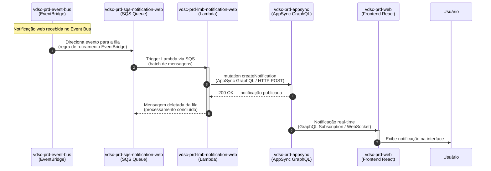

# MS Notification Web

[](https://github.com/11soat-hackathon-videoslice/ms-notification-web/actions/workflows/build_test_deploy_lambda.yaml)
[](https://sonarcloud.io/summary/new_code?id=11soat-hackton-videoslice_ms-notification-web)

Microserviço AWS Lambda para processamento de notificações web em tempo real.

## 📋 Visão Geral

O **ms-notification-web** é um microserviço serverless implementado como AWS Lambda Function que processa notificações web em tempo real do sistema VideoSlice. 
Este serviço consome mensagens de uma fila SQS contendo notificações de eventos do sistema (upload, processamento, conclusão de vídeos) e envia notificações em tempo real para o frontend via AWS AppSync.


### Funcionalidades

- **Processamento de Notificações Web**: Consome mensagens da fila SQS com notificações
- **Validação de Canal**: Valida se a notificação contém canal WEB e conteúdo web
- **Notificações em Tempo Real**: Envia notificações via AppSync GraphQL subscriptions
- **Integração com Core**: Utiliza a biblioteca video-slice-core para lógica de negócio
- **Processamento em Lote**: Processa múltiplos registros de uma única vez

## 🏗️ Arquitetura

O microserviço segue os princípios da **Clean Architecture**, utilizando a biblioteca core [video-slice-core](https://github.com/11soat-hackathon-videoslice/video-slice-core) para implementação das camadas de domínio e aplicação.

### Fluxo de Execução

1. **EventBridge** captura eventos de notificação do sistema
2. **SQS Queue** armazena as mensagens de notificação
3. **Lambda Function** é trigada pela fila SQS
4. **NotificationController** (da biblioteca core) processa a notificação
5. **AppSyncNotificationWeb** envia notificação via AppSync GraphQL
6. **Frontend** recebe notificação em tempo real via subscription
7. **Response** retorna status de processamento

# Diagrama de Sequência — Notificação Web Real-time para Usuário



## 🚀 Tecnologias

- **Python 3.12**: Linguagem de programação
- **AWS Lambda**: Plataforma serverless
- **AWS SQS**: Fila de mensagens
- **AWS AppSync**: GraphQL API para notificações em tempo real
- **AWS EventBridge**: Barramento de eventos
- **Boto3**: SDK AWS para Python
- **video-slice-core**: Biblioteca core com domínio e casos de uso

## 📦 Dependências

### Dependências de Produção
- `boto3`: SDK AWS para Python
- `requests`: Cliente HTTP
- `requests-aws4auth`: Autenticação AWS Signature V4
- `vdsc-core`: Biblioteca core com lógica de negócio

### Dependências de Desenvolvimento
- `pytest`: Framework de testes
- `pytest-cov`: Cobertura de testes
- `pytest-mock`: Mock para testes
- `pytest-asyncio`: Suporte a testes assíncronos
- `moto`: Mock de serviços AWS

## 🔧 Configuração

### Variáveis de Ambiente

A Lambda Function requer as seguintes variáveis de ambiente:

| Variável | Descrição | Exemplo |
|----------|-----------|---------|
| `AWS_REGION` | Região AWS (configurada automaticamente) | `us-east-1` |
| `APPSYNC_API_URL` | URL da API AppSync | `https://xxxxx.appsync-api.us-east-1.amazonaws.com/graphql` |
| `APPSYNC_API_KEY` | Chave de API do AppSync | `da2-xxxxxxxxxxxxxxxxx` |

**Nota**: As variáveis `AWS_REGION` e `PYTHON_VERSION` são configuradas automaticamente pela AWS e não devem ser incluídas na configuração da Lambda.

## 📨 Estrutura de Mensagens

### Evento SQS de Entrada

```json
{
  "Records": [
    {
      "messageId": "b22abd8b-bc65-49ac-ac27-35cb0c8f4e25",
      "body": "{\"detail\":{\"channels\":[\"EMAIL\",\"WEB\"],\"content\":[{\"web\":{\"message\":\"Vídeo processado com sucesso\",\"timestamp\":\"2026-02-19T10:44:00Z\",\"user_id\":\"848834a8-20e1-7004-ee3b-4ba1495239d8\"}}],\"id\":\"79cdb25a-2d73-33b8-a2a2-e67db110961a\",\"metadata\":{\"videoId\":\"mkvltfiozmaT\",\"fileName\":\"Video Project 1\",\"status\":\"FINISHED\"}}}",
      "eventSource": "aws:sqs",
      "eventSourceARN": "arn:aws:sqs:us-east-1:080145351546:vdsc-prd-sqs-notification-web"
    }
  ]
}
```

### Resposta de Sucesso (202)
```json
{
  "statusCode": 202,
  "body": "{\"status\": \"Recebido 1 evento(s) para processamento.\"}"
}
```

### Resposta de Erro (500)
```json
{
  "statusCode": 500,
  "body": "{\"error\": \"Erro ao processar notificação: [detalhes do erro]\"}"
}
```

## 🔌 Integração AppSync

### Mutation GraphQL

O serviço envia notificações via AppSync usando a seguinte mutation:

```graphql
mutation PublishNotification($input: NotificationInput!) {
  publishNotification(input: $input) {
    id
    message
    timestamp
    userId
    metadata
  }
}
```

### Subscription no Frontend

O frontend pode receber notificações em tempo real usando:

```graphql
subscription OnNotification($userId: ID!) {
  onNotification(userId: $userId) {
    id
    message
    timestamp
    userId
    metadata
  }
}
```

## 🧪 Testes

### Executar Testes Unitários

```bash
cd "C:\Users\A0157633\dev\java\f5\ms-notification-web"
pytest tests/unit/ --cov=src/core --cov-report=xml:coverage.xml --cov-report=html --cov-report=term --junitxml=test-results.xml -v --cov-fail-under=80
```

**Nota**: Os arquivos de configuração `pytest.ini` e `conftest.py` estão localizados dentro do diretório `tests/`.

### Cobertura de Testes

O projeto mantém cobertura mínima de **80%** dos testes unitários, validada automaticamente na pipeline de CI/CD.

### Análise de Qualidade

```bash
pysonar --sonar-token=<seu-token>
```

A análise de qualidade é realizada automaticamente pelo SonarCloud a cada push/PR.

## 🚀 Deploy

### Pipeline CI/CD

O deploy é automatizado através do GitHub Actions. A pipeline executa:

1. **Testes Unitários**: Execução de todos os testes com cobertura mínima de 80%
2. **Quality Gate**: Validação de qualidade de código no SonarCloud
3. **Build**: Empacotamento da Lambda Function com dependências
4. **Deploy**: Deploy automático na AWS Lambda

### Deploy Manual

Para executar deploy manual:

```bash
# Via GitHub Actions
# 1. Acesse a aba "Actions" no repositório
# 2. Selecione "Build, Test and Deploy vdsc-prd-lmb-notification-web"
# 3. Clique em "Run workflow"
# 4. Configure "deploy_only" como true para pular os testes
```

### Logs

Os logs da Lambda Function estão disponíveis no CloudWatch Logs:
- Grupo: `/aws/lambda/vdsc-prd-lmb-notification-web`
- Região: `us-east-1`


## 🔗 Integração

### Trigger
- **SQS Queue**: `vdsc-prd-sqs-notification-web`
- **Batch Size**: Configurável (padrão: 10)
- **Visibility Timeout**: 300 segundos

### Recursos Relacionados
- **EventBridge**: Captura eventos de notificação do sistema
- **AppSync**: Envia notificações em tempo real via GraphQL
- **CloudWatch Logs**: Armazena logs de execução

## 🔐 Permissões IAM

A Lambda Function requer as seguintes permissões:

- `sqs:ReceiveMessage`
- `sqs:DeleteMessage`
- `sqs:GetQueueAttributes`
- `appsync:GraphQL`
- `logs:CreateLogGroup`
- `logs:CreateLogStream`
- `logs:PutLogEvents`

## 📊 Tipos de Notificações

O serviço processa os seguintes tipos de notificações:

- **UPLOADED**: Vídeo enviado com sucesso
- **PROCESSING**: Vídeo em processamento
- **FINISHED**: Processamento concluído
- **ERROR**: Erro no processamento

**Versão**: 1.0.0  
**Região AWS**: us-east-1  
**Runtime**: Python 3.12
